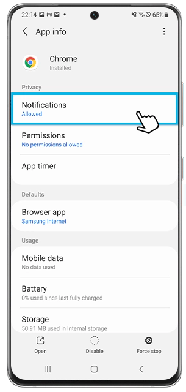

<h2>Notification push</h2>

<pre>
  * Vue, Laravel, PWA, Passport, Make Speech
</pre>

## How to use

- Clone the repository with __git clone__

__Back-end__

- Go to the sub-folder `cd laravel-api`
- Copy __.env.example__ file to __.env__ and edit database credentials there
- Add correct value of your domain for front URL in this variable: `FRONTPAGE_VERIFY_URL=[your_domain]/verify/`
- Run __composer install__
- Run __php artisan key:generate__
- Run __php artisan migrate --seed__ (it has some seeded data for your testing)
- Run __php artisan passport:install__

__Front-end__

- Go to the sub-folder `cd front`
- Run __yarn install__ 
- Run __yarn start__ 
- That's it: launch the URL that appears in the terminal - could be `http://localhost:8080`

## License

Basically, feel free to use and re-use any way you want.

---

## More from our LaravelDaily Team

- Check out our adminpanel generator [QuickAdminPanel](https://quickadminpanel.com)
- FREE E-book: [100 Laravel Quick Tips (and counting)](https://laraveldaily.com/free-e-book-40-laravel-quick-tips-and-counting/)
- Subscribe to our [YouTube channel Laravel Business](https://www.youtube.com/channel/UCTuplgOBi6tJIlesIboymGA)
- Enroll in our [Laravel Online Courses](https://laraveldaily.teachable.com/)

# Vue-Laravel
